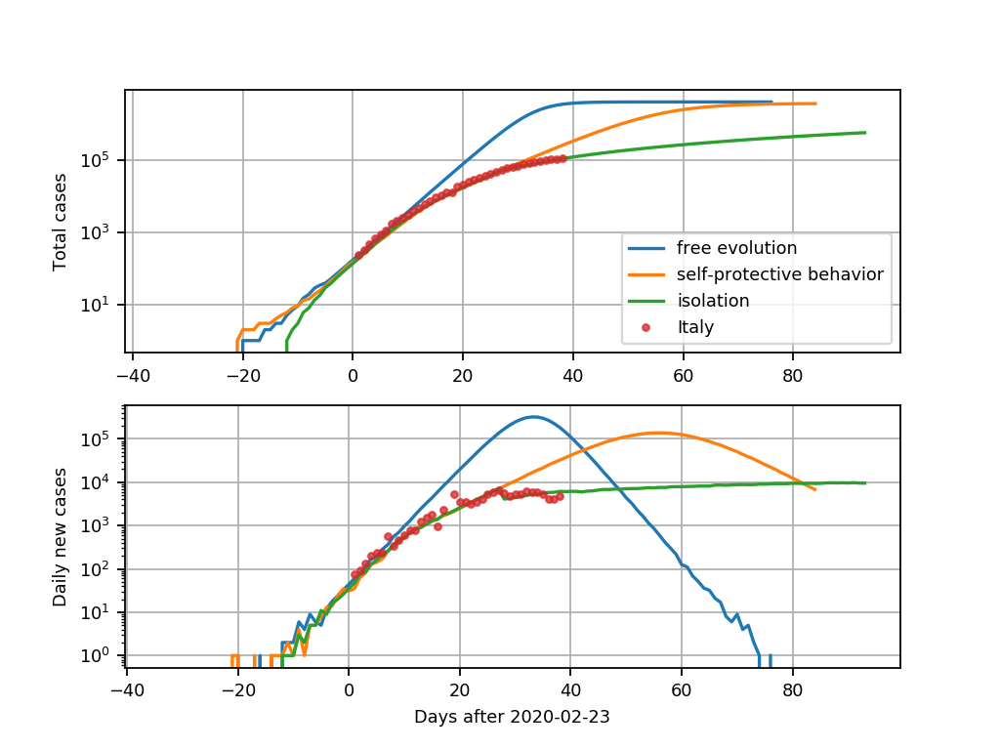
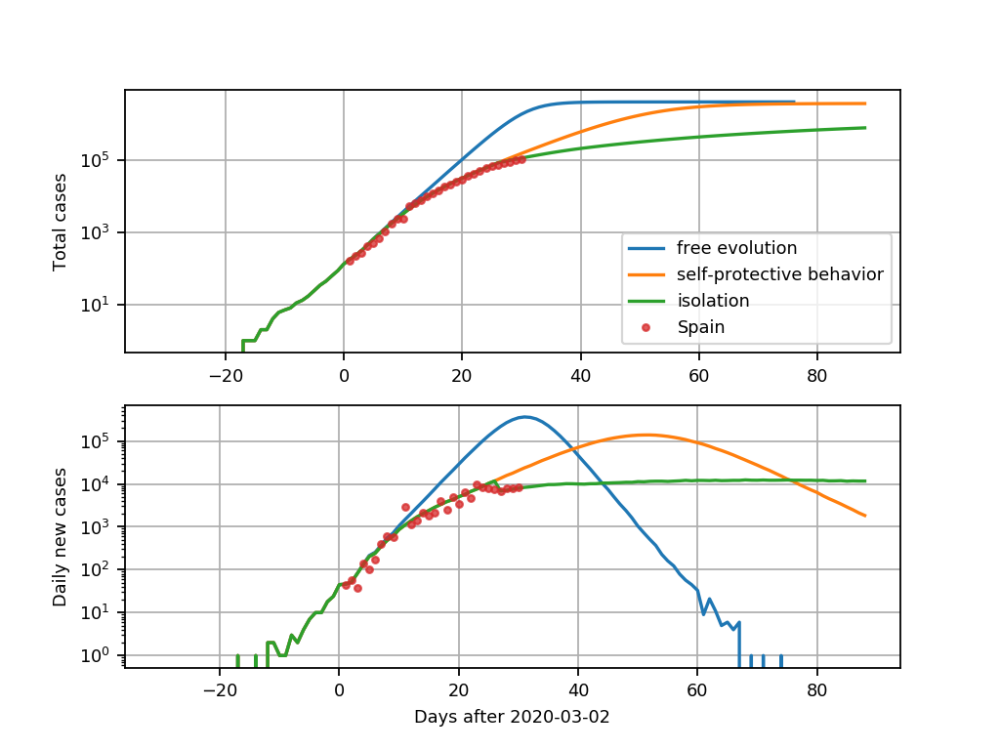

# A stochastic SIR epidemic model on a complex network with self-protective behaviour

The state of each individual in this system in given by one of the following classes:
* Susceptible (S)
* Infected (I)
* Recovered (R)

## Parameters

Paramater     | Description                | Reference value
:---:         | ---                        | :---:
Ti | Infectious period          | 14
qi | Probability of infection   | 0-0.02
p             | Shortcut density           | 0-16
t0 | Isolation start time       | 30
N             | Population size            | 4E6
NR | Number of cases triggering self-protective behaviour | 10E3-10E4

## Simulations

### Italy

### Spain

